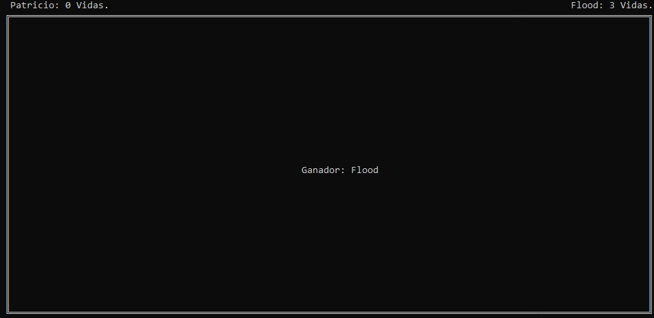

# CPPGame

2 player shooter game, with console interface, built with C++

### Controls:

Player 1:
* Movement: WASD
* Shot: Space

Player2:
* Movement: Arrows
* Shot: Enter

### Game Dynamics:

Each player has 3 lives and infinite shots, the player who first kills the opponent 3 times wins. Characters can move within the limits of the map.

### Screenshots:

